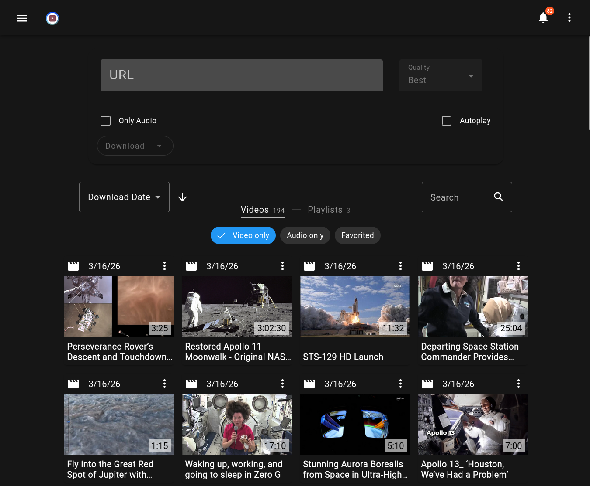

<h1>
  
  ytdl-material
</h1>

[](https://hub.docker.com/r/voc0der/ytdl-material)
[](https://hub.docker.com/r/voc0der/ytdl-material)
<a href="https://github.com/voc0der/ytdl-material/tree/main/backend/test">
  
</a>
[](https://github.com/voc0der/ytdl-material/issues)
[](https://github.com/voc0der/ytdl-material/blob/main/LICENSE.md)
[](https://github.com/voc0der/ytdl-material/network/dependencies)

ytdl-material is a Material Design frontend for [youtube-dl](https://rg3.github.io/youtube-dl/) / yt-dlp workflows. It's coded using [Angular 21](https://angular.dev/) for the frontend, and [Node.js](https://nodejs.org/) on the backend.

<hr>



## Docker

### Setup

1. Download [docker-compose.yml](https://github.com/voc0der/ytdl-material/blob/main/docker-compose.yml):

```bash
curl -L https://raw.githubusercontent.com/voc0der/ytdl-material/refs/heads/main/docker-compose.yml -o docker-compose.yml
```

2. Start it:

```bash
docker compose pull   # if needed
docker compose up -d
```

Docker environment variables: [docker-environment.md](./docker-environment.md). See [Wiki](https://github.com/voc0der/ytdl-material/wiki#environment-specific-guideshelp) for host-specific instructions.

#### Build manually
See the [install and build guide](./install-and-build.md).

## API

Enable the public API in Settings -> *Extra*, generate an API key if needed, then enable API docs (restart required) for endpoint details.

## Contributing

Review [CONTRIBUTING.md](./CONTRIBUTING.md) for contributor guidelines; pull requests and issues for bugs or feature requests are welcome.

## Legal Disclaimer

This project is in no way affiliated with Google LLC, Alphabet Inc. or YouTube (or their subsidiaries) nor endorsed by them.

## Star History

<p align="center">
  <a href="https://star-history.com/#voc0der/ytdl-material&Date">
    <picture>
      <source media="(prefers-color-scheme: dark)" srcset="https://api.star-history.com/svg?repos=voc0der/ytdl-material&type=Date&theme=dark" />
      <source media="(prefers-color-scheme: light)" srcset="https://api.star-history.com/svg?repos=voc0der/ytdl-material&type=Date" />
      
    </picture>
  </a>
</p>
