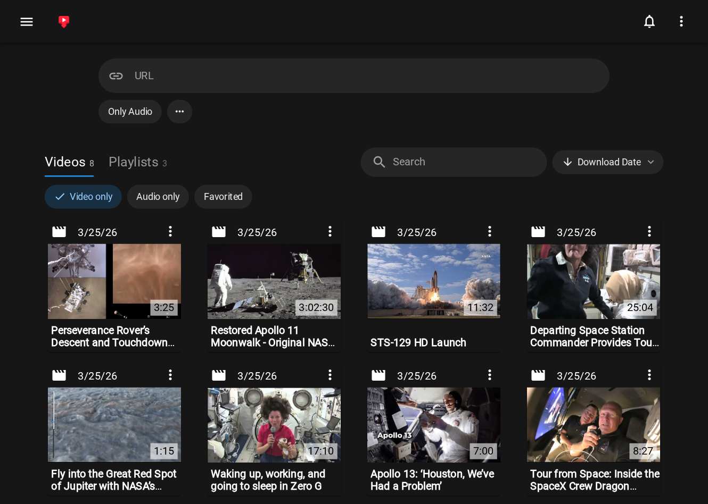

<h1>
  
  ytdl-material
</h1>

[](https://hub.docker.com/r/voc0der/ytdl-material)
[](https://hub.docker.com/r/voc0der/ytdl-material)
<a href="https://github.com/voc0der/ytdl-material/blob/main/CONTRIBUTING.md#coverage">
  
</a>
[](https://github.com/voc0der/ytdl-material/issues)
[](https://github.com/voc0der/ytdl-material/blob/main/LICENSE.md)
[](https://github.com/voc0der/ytdl-material/releases/latest)
[](https://github.com/voc0der/ytdl-material/actions/workflows/dependencies.yml)

Download and watch video and audio from a web app you host yourself. Paste a link to download something, or subscribe to channels and playlists and new uploads show up automatically. Everything goes into a library you can watch from any browser, solo or together. It runs on [yt-dlp](https://github.com/yt-dlp/yt-dlp), which it installs and updates for you. See the [full feature list](https://voc0der.github.io/ytdl-material/features/).

**[Documentation](https://voc0der.github.io/ytdl-material/)** · [Quick start](https://voc0der.github.io/ytdl-material/getting-started/quick-start/) · [Troubleshooting](https://voc0der.github.io/ytdl-material/reference/troubleshooting/)

<hr>


<br>
<sub>More screenshots in the <a href="https://voc0der.github.io/ytdl-material/gallery/">gallery</a>.</sub>

## Setup

### Docker

1. Download [docker-compose.yml](https://github.com/voc0der/ytdl-material/blob/main/docker-compose.yml):

```bash
curl -L https://raw.githubusercontent.com/voc0der/ytdl-material/refs/heads/main/docker-compose.yml -o docker-compose.yml
```

2. Start it:

```bash
docker compose pull   # if needed
docker compose up -d
```

Docker environment variables: [reference](https://voc0der.github.io/ytdl-material/reference/environment/). See the [NAS and ARM host guide](https://voc0der.github.io/ytdl-material/deployment/platforms/) for host-specific instructions.

#### Migration
For an existing installation, follow the [migration guide](https://voc0der.github.io/ytdl-material/deployment/migration/) before replacing your Compose file or changing database engines.

#### Build manually
See the [install and build guide](./install-and-build.md).

## Contributing

Review [CONTRIBUTING.md](./CONTRIBUTING.md) for contributor guidelines; pull requests and issues for bugs or feature requests are welcome.

## Legal Disclaimer

This project is in no way affiliated with Google LLC, Alphabet Inc. or YouTube (or their subsidiaries) nor endorsed by them.
