# Gallery

ytdl-material in a desktop browser and on a phone. Select a screenshot to see it full size, then use the arrow keys or the buttons beside it to move through the rest.
{ .docs-intro }

## Desktop

<figure markdown="span">
[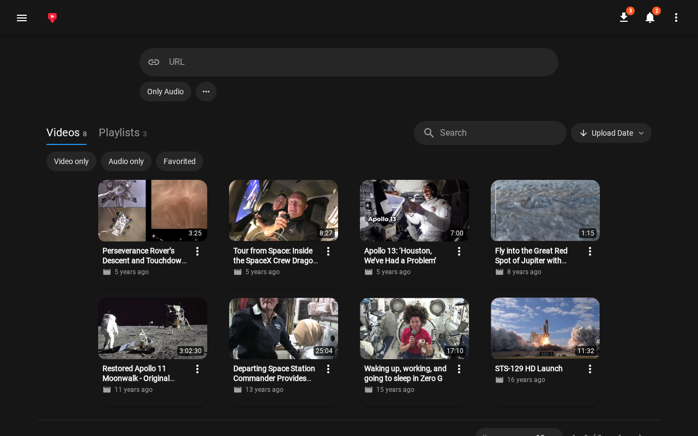{ width="1280" height="800" loading="lazy" }](images/gallery/desktop-library.png)
<figcaption>The library, sorted by upload date</figcaption>
</figure>

<figure markdown="span">
[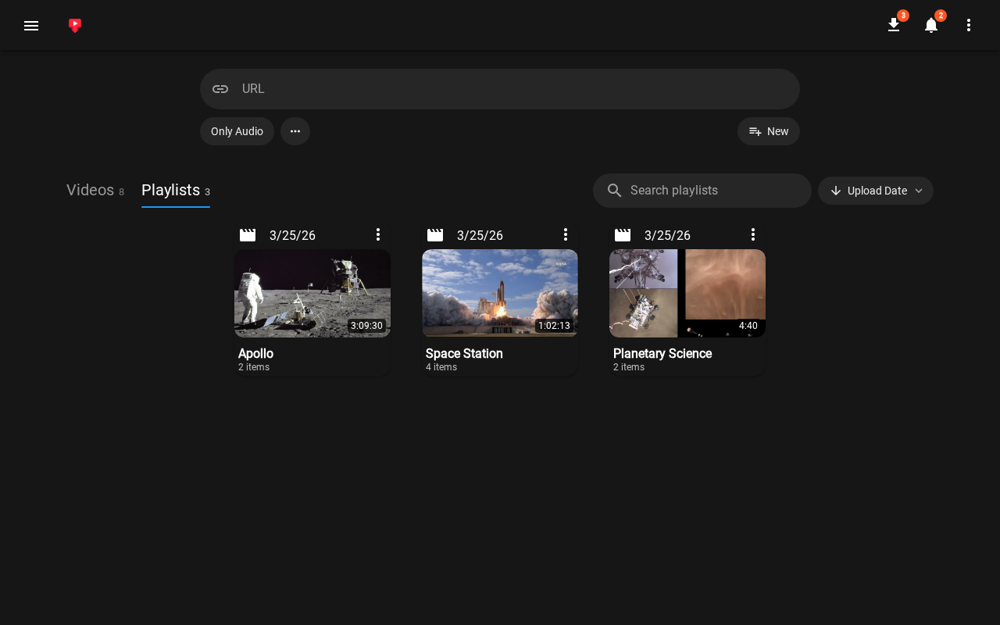{ width="1280" height="800" loading="lazy" }](images/gallery/desktop-playlists.png)
<figcaption>Playlists built from the library</figcaption>
</figure>

<figure markdown="span">
[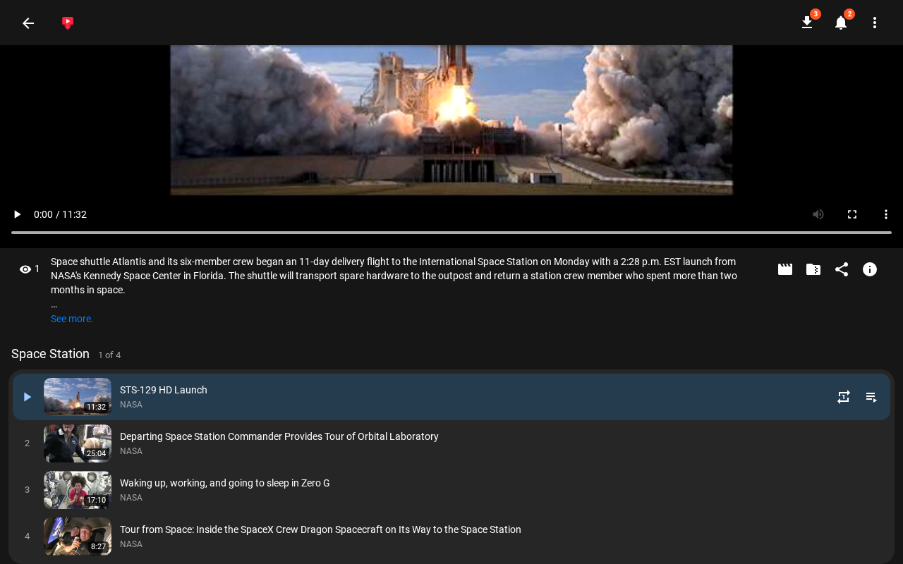{ width="1280" height="800" loading="lazy" }](images/gallery/desktop-player.png)
<figcaption>The player working through a playlist</figcaption>
</figure>

<figure markdown="span">
[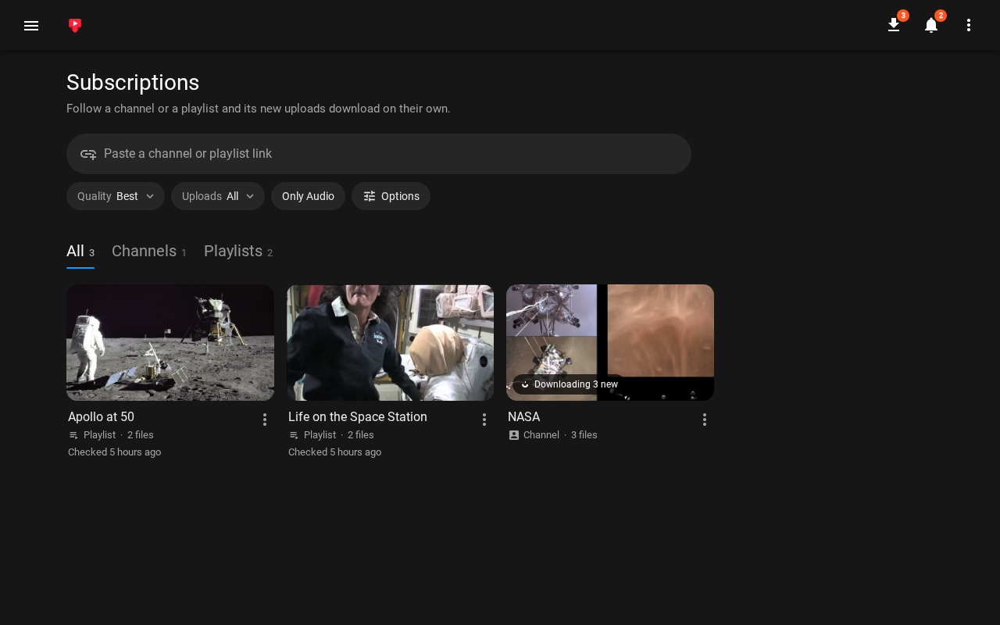{ width="1280" height="800" loading="lazy" }](images/gallery/desktop-subscriptions.png)
<figcaption>Subscriptions to a channel and two playlists</figcaption>
</figure>

<figure markdown="span">
[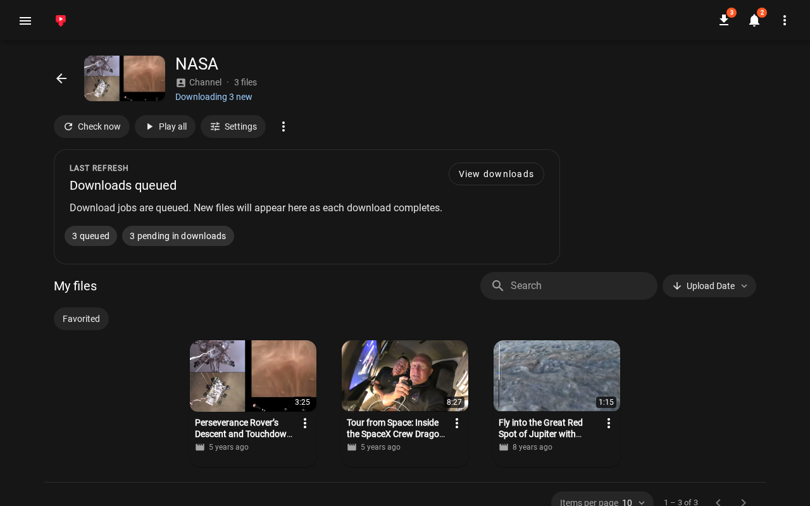{ width="1280" height="800" loading="lazy" }](images/gallery/desktop-subscription.png)
<figcaption>One subscription, mid-check</figcaption>
</figure>

<figure markdown="span">
[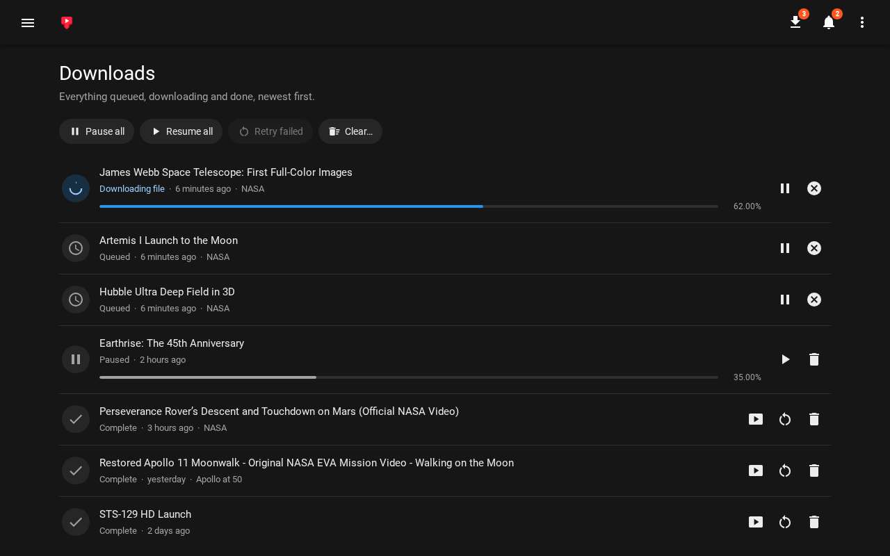{ width="1280" height="800" loading="lazy" }](images/gallery/desktop-downloads.png)
<figcaption>Downloads in progress, queued, paused, and done</figcaption>
</figure>

<figure markdown="span">
[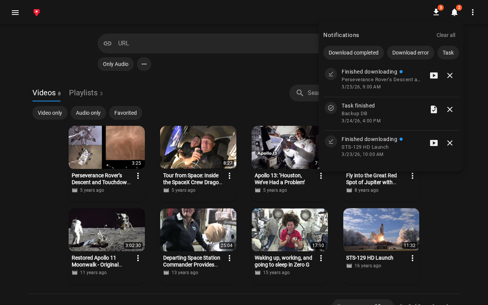{ width="1280" height="800" loading="lazy" }](images/gallery/desktop-notifications.png)
<figcaption>Notifications, with actions for each</figcaption>
</figure>

<figure markdown="span">
[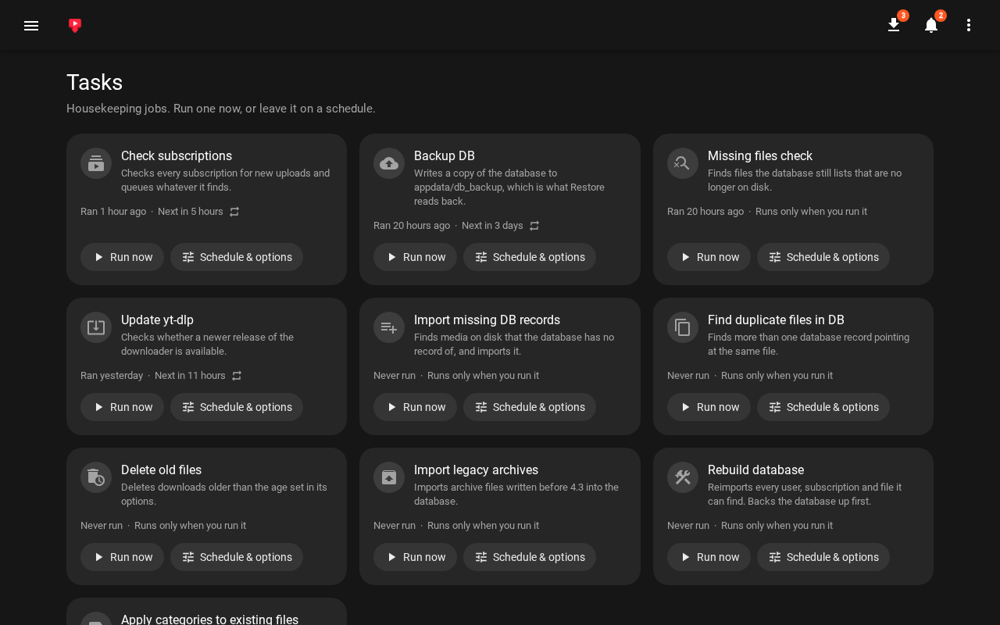{ width="1280" height="800" loading="lazy" }](images/gallery/desktop-tasks.png)
<figcaption>Tasks, some on a schedule</figcaption>
</figure>

<figure markdown="span">
[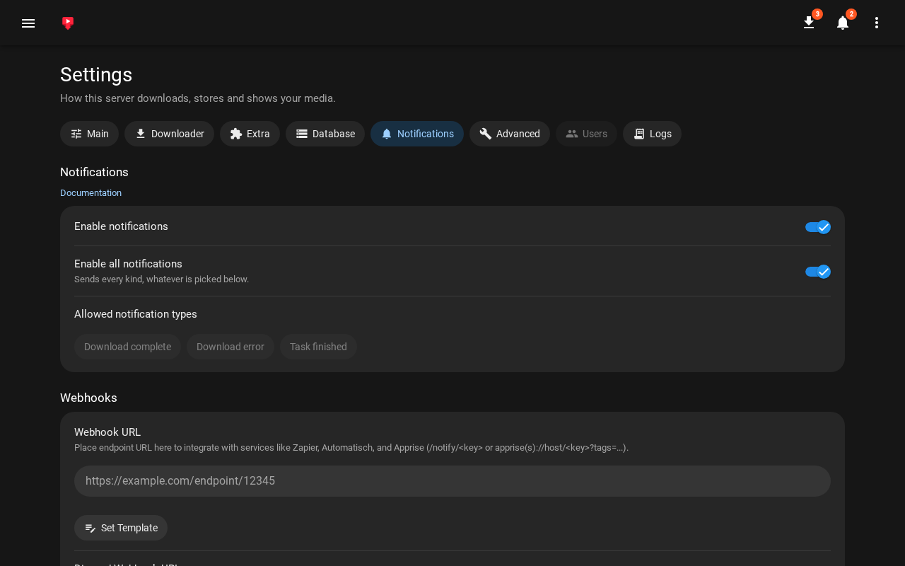{ width="1280" height="800" loading="lazy" }](images/gallery/desktop-settings.png)
<figcaption>Settings for notifications and webhooks</figcaption>
</figure>

<figure markdown="span">
[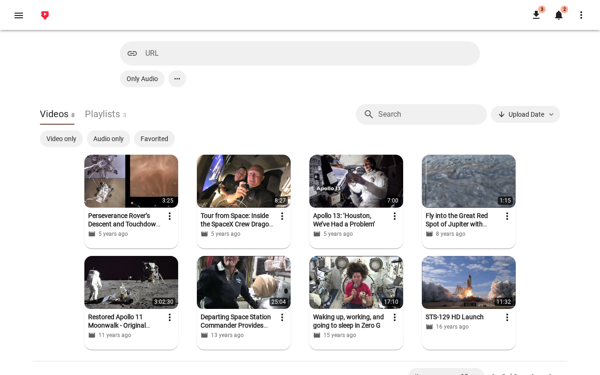{ width="1280" height="800" loading="lazy" }](images/gallery/desktop-light.png)
<figcaption>The light theme</figcaption>
</figure>

## Mobile

<figure markdown="span">
[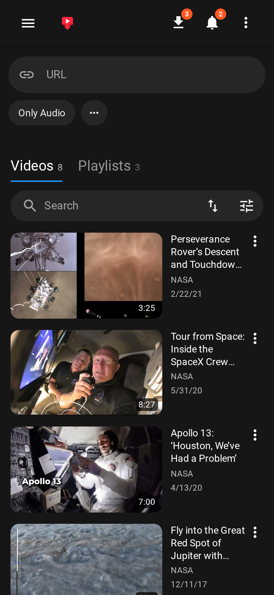{ width="780" height="1688" loading="lazy" }](images/gallery/phone-library.png)
<figcaption>The library</figcaption>
</figure>

<figure markdown="span">
[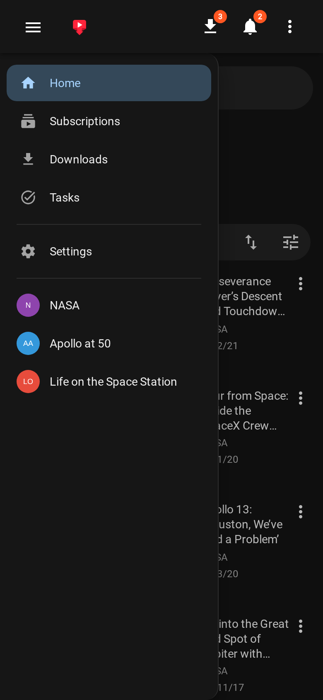{ width="780" height="1688" loading="lazy" }](images/gallery/phone-navigation.png)
<figcaption>Navigation, with your subscriptions</figcaption>
</figure>

<figure markdown="span">
[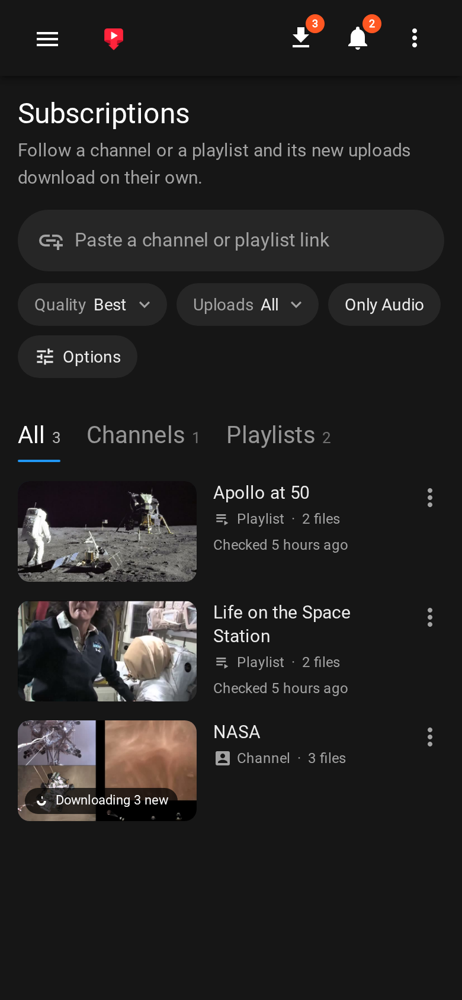{ width="780" height="1688" loading="lazy" }](images/gallery/phone-subscriptions.png)
<figcaption>Subscriptions</figcaption>
</figure>

<figure markdown="span">
[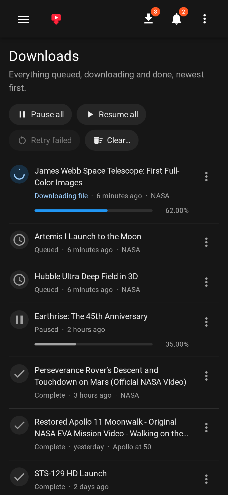{ width="780" height="1688" loading="lazy" }](images/gallery/phone-downloads.png)
<figcaption>Downloads</figcaption>
</figure>

<figure markdown="span">
[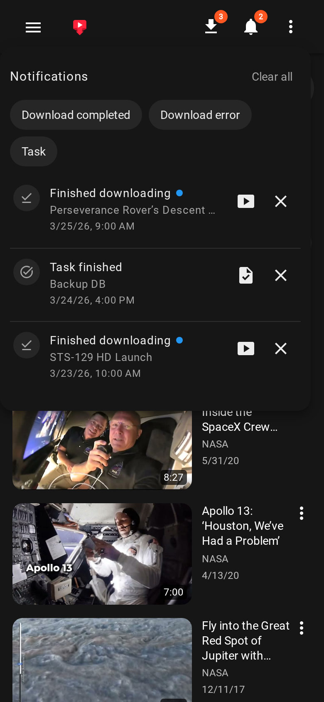{ width="780" height="1688" loading="lazy" }](images/gallery/phone-notifications.png)
<figcaption>Notifications</figcaption>
</figure>

<figure markdown="span">
[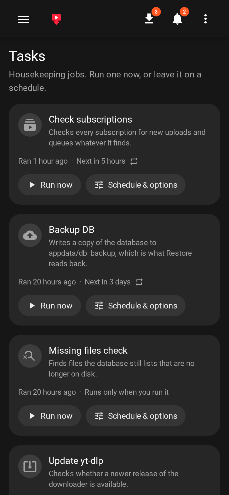{ width="780" height="1688" loading="lazy" }](images/gallery/phone-tasks.png)
<figcaption>Tasks</figcaption>
</figure>

The library shown is a sample of NASA videos, which NASA makes available for free use. To see what each page does, start with [downloads](usage/downloads.md), the [library](usage/library.md), and [subscriptions](usage/subscriptions.md).
